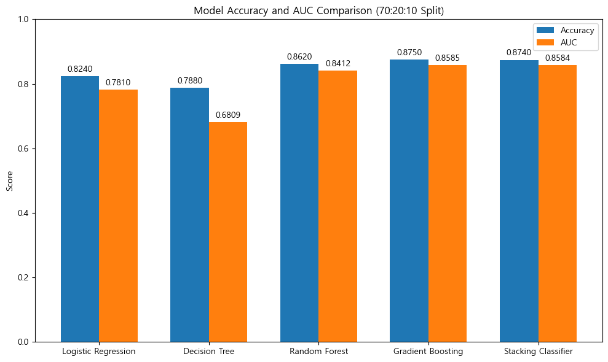

# SKN10-2nd-1Team
# [은행 고객 이탈 예측](https://www.kaggle.com/datasets/gauravtopre/bank-customer-churn-dataset/data)
 SK Networks AI Camp 10기

 개발기간: 25.02.19 - 25.03.05
 

# **1. 팀 소개**

### 팀명 : 1 팀
### 팀원 소개
<table align=center>
<tbody>
 <tr>
   
      <td align=center><b>배민경👑</b></td>
      <td align=center><b>장윤홍</b></td>
      <td align=center><b>이유호</b></td>
      <td align=center><b>남궁세정</b></td>
      <td align=center><b>황인호</b></td>
    </tr>
     
  <tr>
      <td><a href="https://github.com/baeminkyeong">
@baeminkyeong
</a></td>
      <td><a href="https://github.com/yuuunong">
@yuuunong
</a></td>
      <td><a href="https://github.com/netsma">
@netsma
</a></td>
      <td><a href="https://github.com/petoriko">
@petoriko
</a></td>
      <td><a href="https://github.com/HIHO999">
@HIHO999
</a></td>
    </tr>
     </tr>
   </tbody>
</table>
 

# 2. 프로젝트 개요

### 프로젝트
- 은행 가입고객 이탈자 분석 및 예측

### 목표
- 본 프로젝트는 데이터 분석 및 머신러닝, 딥러닝을 활용하여 **은행 고객의 이탈 가능성을 예측하는 모델**을 개발하는 것입니다.

### 프로젝트 배경

- https://www.hanaif.re.kr/boardDetail.do?hmpeSeqNo=35933 하나금융연구소 - "2024년, 은행이 놓치지 말아야 할 3가지" 장혜원 수석연구원

- 금융 시장에서 고객관계 강화는 은행의 최우선 과제 중 하나입니다.

- 그러나 디지털 전환 비용과 함께 다양한 경쟁자 참여로 전통적인 금융기관의 마케팅 비용은 매해 증가하는 반면, 고객 충성도는 하락하고 있는 상황

 

- https://www.mkhealth.co.kr/news/articleView.html?idxno=32040 매경이코노미 -"[경영칼럼] 신규 고객 늘리기보다 기존 고객 유지 힘써라" 이성용

- **기존 고객 유지를 하는 것이 신규 고객을 유치하는 것보다 수익성 5 ~ 7배 향상**된다고 알려져 있습니다.

- 따라서, 기존 고객의 이탈을 방지하는 것이 운영 비용 절감 및 수익성 강화에 효과적인 전략이 될 수 있습니다.

- 이에 따라, 사전적으로 고객 이탈을 예측하고 선제적으로 대응할 수 있는 데이터 기반의 고객 이탈 예측 모델이 필요하게 되었습니다.

 

### 기대 효과
| 기대효과 |내용|
|------|---|
|고객이탈 방지|이탈 가능성이 높은 고객을 조기에 발견하여 맞춤형 프로모션 및 상담 제공|
|비용절감|고객 유지 비용 절감 및 신규 고객 유치 비용 최소화|
|비즈니스 성장|데이터 기반 의사결정을 통한 은행의 경쟁력 강화 및 고객 만족도 향상|

### 요약
- 본 프로젝트를 통해 은행은 고객 이탈 문제를 보다 효과적으로 해결하고, **장기적인 고객 관계 관리를 강화**할 수 있습니다.

- 데이터 기반의 **예측 모델을 활용**하여 고객 맞춤형 전략을 수립함으로써 전통적인 은행의 지속 가능한 성장을 도모하는 것이 본 프로젝트의 최종 목표입니다.

# 3. 기술 스택

| 분야 |기술|
|------|---|
|협업 및 형상 관리|  |
|개발 환경 & 언어| |
|데이터 분석 & 학습|    |
|대시보드||

# 4. 데이터 내용 확인
- ABC 은행의 고객 이탈 데이터  
- 출처: https://www.kaggle.com/datasets/gauravtopre/bank-customer-churn-dataset
 

| 변수명             | 변수 설명                                             | 변수 타입   |
|-------------------|----------------------------------------------------|------------------|
| customer_id       | 고객을 구별하는 고유 ID               | object      |
| credit_score      | 고객의 신용 점수                    | int64            |
| country           | 고객이 거주하는 국가                | object (범주형)   |
| gender            | 고객의 성별                        | object (범주형)   |
| age               | 고객의 나이                        | int64            |
| tenure            | 고객의 은행 가입 기간             | int64            |
| balance           | 고객의 은행 잔액                  | float64          |
| products_number   | 고객이 보유한 은행 상품 수        | int64            |
| credit_card       | 고객의 신용카드 보유 여부    | int64 (범주형)     |
| active_member     | 고객의 활성 회원 여부       | int64 (범주형)     |
| estimated_salary  | 고객의 추정 급여                   | float64          |
| churn             | 고객의 이탈 여부  | int64 (범주형)     |

- 변수 : credit_score (신용 점수), country (국가), age (나이), tenure (가입 기간), churn (이탈 여부) 등의 변수  
- 데이터 크기: 총 10,000명의 고객 데이터, 12개의 변수 (2개의 object형 변수, 8개의 int형 변수, 2개의 float형 변수)  
- 데이터 유형: 5개의 범주형 데이터, 7개의 수치형 데이터
  
# 5. 데이터 전처리

**1. 데이터 요약 및 탐색**
- 특정 수치형 변수(신용점수, 잔액, 나이, 예상 연봉)의 기본 통계량(개수, 평균, 표준편차, 최소값, 25%/50%/75% 백분위수, 최대값)을 확인합니다.
- 효과 : 데이터 분포, 중앙값, 범위 등을 파악하여 이상치나 결측치 등을 확인할 수 있습니다.
  
**2. 값 제한 처리**
- 목적 : 특정 변수의 값이 지나치게 크거나 이상치일 경우 임계값을 설정해 제한하여 데이터 분포의 왜곡을 방지하고, 분석 및 모델 학습 과정에서 안정적인 입력을 확보합니다.
- 효과 : 이상치의 부정적 영향을 줄이고, 모델이 정상 범위의 데이터에 집중하여 예측 성능과 일반화 능력을 향상시키며, 해석과 시각화가 용이해집니다.
  
**3. 수치형 변수의 범주화**
- 목적 : 신용점수, 잔액, 나이 등 연속형 데이터를 의미 있는 구간으로 나누어 데이터를 단순화하고 해석하기 쉽게 합니다.
- 효과 : 범주화된 데이터는 그룹별 비교를 용이하게 하고 이상치의 영향을 줄여 모델의 성능을 향상시킵니다.
  
**4. 데이터 시각화 및 이상치 처리**
- 목적 : 연속형 데이터를 몇 개의 범주로 나누어 데이터를 단순화하고 이해하기 쉽게 만듭니다.
- 효과 : 모델 성능 개선과 그룹별 분석을 용이하게 하여 이상치의 영향을 줄입니다.

 # 6. 머신러닝
 
## 효과 좋은 방법

- **스케일링:**  
  데이터를 StandardScaler나 MinMaxScaler와 같은 방법으로 정규화하여, 머신러닝 알고리즘(예: 로지스틱 회귀, SVM 등)이 각 특성의 영향을 균형 있게 받아들이도록 함으로써 학습의 안정성과 예측 성능을 크게 향상시켰습니다.

- **SMOTE (Synthetic Minority Over-sampling Technique):**  
  데이터 불균형 문제를 해결하기 위해 SMOTE를 적용하여 소수 클래스 데이터를 증강하였습니다. 이로 인해 클래스 간 균형이 개선되어, 특히 불균형 데이터셋에서 모델의 예측 성능이 향상되었습니다.
  
# 7. 딥러닝

- **복잡한 패턴 학습 :** 딥러닝의 특성을 활용하여 데이터 내 복잡한 비선형 패턴과 변수 간 상호작용을 효과적으로 학습, 고객 이탈 예측 문제에 적합합니다.
- **특성 공학 감소 :** 자동으로 중요한 특성을 추출하므로, 별도의 복잡한 특성 가공 과정 없이도 효율적인 모델링이 가능합니다.
- **모델 성능 :** 초기 실험에서 LLM은 랜덤 포레스트 등 전통적인 모델보다 높은 AUC와 정확도를 보이며, 실제 운영 환경에서 신뢰성 있는 예측 결과를 제공했습니다.

## 데이터 불균형 문제 해결 시도:
- 초기에는 데이터 불균형 문제를 해결하기 위해 SMOTE(Synthetic Minority Over-sampling Technique)를 적용하려고 했습니다. 이탈자와 비이탈자의 비율이 2:8로 불균형하여, SMOTE를 통해 이탈자 데이터를 증강하여 균형을 맞추고자 했습니다.
- 그러나 SMOTE를 적용한 결과, 이탈자에 대한 정확도는 개선되었지만, 주류인 비이탈자에 대한 정확도가 떨어지는 문제가 발생했습니다. 이는 모델이 이탈자 데이터를 과대적합하게 학습하여 전체적인 성능이 저하되는 결과를 초래했습니다.
- 따라서 최종적으로 SMOTE를 제외하고 원본 데이터로 모델을 학습하였습니다.

# 8. 실행 결과

# 9.  회고
- **배민경 :**
  데이터 전처리부터 모델 스코어 향상에 집중하였습니다.  모델 스코어 보다는 의미 있는 피쳐를 찾아내고 분석하여 데이터를 알아가는 시간을 좀 더 보냈을면 좋았을 것 같습니다. 
- **장윤홍 :**
  아무리 데이터를 전처리하고 모델 튜닝을 하여도 의미있는 스코어 상승이 별로 없었던 것 같습니다.  모델을 튜닝하는것도 중요하지만 좋은 피쳐 데이터를 수집하는 것도 중요하다는 것을 알게 되었습니다.
- **이유호 :**
  데이터를 추출하고 분석해 그래프를 그리는데, 엑셀에서 작성한 수준만큼 파이썬에서 구현할 수는 없었고 시간 소모도 상대적으로 많았습니다.  엑셀보다는 파이썬을 다루는 것이 더 편하도록 코딩 실력을 더 키워야겠습니다.
- **남궁세정 :**
  이번에 chatgpt를 많이 활용했는데 명령하는데 고생했습니다. 그래서 명령을 구체적으로 하는 방법을 익혔고 chatgpt활용방법을 알게되었습니다.  무엇보다도 깨달은 것은 백업이 중요성입니다.백업 항상해야하는구나. 그 뒤로 절대로 휴지통 절대 안비워요.
- **황인호 :**
  llm을 활용하게 되면서 llm이 분석을 하기 위한 정보들을 무엇을 어떤 식으로 전달할지를 고심하였습니다.  또한 llm이 각 시도 마다 다른 형식의 출력을 하는것을 막기위해 프롬프트를 어떤식으로 제한해야하는지에 대해 공부하게 되었습니다.
