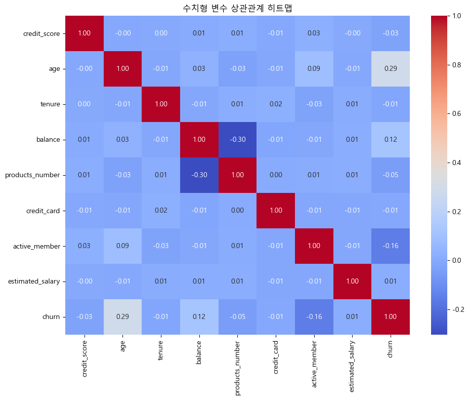

# SKN10-2nd-1Team
# [가입 고객 이탈 예측](https://www.kaggle.com/datasets/gauravtopre/bank-customer-churn-dataset/data)
 SK Networks AI Camp 10기

 개발기간: 25.02.19 - 25.03.05
 

# 0. 팀 소개

### 팀명 : 1 팀
### 팀원 소개
<table align=center>
<tbody>
 <tr>
   
      <td align=center><b>배민경👑</b></td>
      <td align=center><b>장윤홍</b></td>
      <td align=center><b>이유호</b></td>
      <td align=center><b>남궁세정</b></td>
      <td align=center><b>황인호</b></td>
    </tr>
     
  <tr>
      <td><a href="https://github.com/baeminkyeong">
@baeminkyeong
</a></td>
      <td><a href="https://github.com/yuuunong">
@yuuunong
</a></td>
      <td><a href="https://github.com/netsma">
@netsma
</a></td>
      <td><a href="https://github.com/petoriko">
@petoriko
</a></td>
      <td><a href="https://github.com/HIHO999">
@HIHO999
</a></td>
    </tr>
     </tr>
   </tbody>
</table>
 

# 1. 프로젝트 개요

### 프로젝트
- 은행 가입고객 이탈자 분석 및 예측

### 목표
- 본 프로젝트는 데이터 분석 및 머신러닝, 딥러닝을 활용하여 **은행 고객의 이탈 가능성을 예측하는 모델**을 개발하는 것입니다.

### 프로젝트 배경

하나금융연구소 - "2024년, 은행이 놓치지 말아야 할 3가지" 장혜원 수석연구원

- 금융 시장에서 고객관계 강화는 은행의 최우선 과제 중 하나입니다.

- 그러나 디지털 전환 비용과 함께 다양한 경쟁자 참여로 전통적인 금융기관의 마케팅 비용은 매해 증가하는 반면, 고객 충성도는 하락하고 있는 상황

 

매경이코노미 -"[경영칼럼] 신규 고객 늘리기보다 기존 고객 유지 힘써라" 이성용

- **기존 고객 유지를 하는 것이 신규 고객을 유치하는 것보다 수익성 5 ~ 7배 향상**된다고 알려져 있습니다.

- 따라서, 기존 고객의 이탈을 방지하는 것이 운영 비용 절감 및 수익성 강화에 효과적인 전략이 될 수 있습니다.

- 이에 따라, 사전적으로 고객 이탈을 예측하고 선제적으로 대응할 수 있는 데이터 기반의 고객 이탈 예측 모델이 필요하게 되었습니다.

 

### 기대 효과
| 기대효과 |내용|
|------|---|
|고객이탈|이탈 가능성이 높은 고객을 조기에 발견하여 맞춤형 프로모션 및 상담 제공|
|비용절감|고객 유지 비용 절감 및 신규 고객 유치 비용 최소화|
|비즈니스 성장|데이터 기반 의사결정을 통한 은행의 경쟁력 강화 및 고객 만족도 향상|

### 요약
- 본 프로젝트를 통해 은행은 고객 이탈 문제를 보다 효과적으로 해결하고, **장기적인 고객 관계 관리를 강화**할 수 있습니다.

- 데이터 기반의 **예측 모델을 활용**하여 고객 맞춤형 전략을 수립함으로써 전통적인 은행의 지속 가능한 성장을 도모하는 것이 본 프로젝트의 최종 목표입니다.

# 2. 기술 스택

| 분야 |기술|
|------|---|
|협업 및 형상 관리|  |
|개발 환경 & 언어| |
|데이터 분석 & 학습|    |
|대시보드||

# 3. 데이터 전처리 
- ABC 은행의 고객 이탈 데이터  
- 출처: https://www.kaggle.com/datasets/gauravtopre/bank-customer-churn-dataset
 

 **1) 데이터 내용 확인**

| 변수명             | 변수 설명                                             | 변수 타입   |
|-------------------|----------------------------------------------------|------------------|
| customer_id       | 고객을 구별하는 고유 ID               | object      |
| credit_score      | 고객의 신용 점수                    | int64            |
| country           | 고객이 거주하는 국가                | object (범주형)   |
| gender            | 고객의 성별                        | object (범주형)   |
| age               | 고객의 나이                        | int64            |
| tenure            | 고객의 은행 가입 기간             | int64            |
| balance           | 고객의 은행 잔액                  | float64          |
| products_number   | 고객이 보유한 은행 상품 수        | int64            |
| credit_card       | 고객의 신용카드 보유 여부    | int64 (범주형)     |
| active_member     | 고객의 활성 회원 여부       | int64 (범주형)     |
| estimated_salary  | 고객의 추정 급여                   | float64          |
| churn             | 고객의 이탈 여부  | int64 (범주형)     |

- 변수 : credit_score (신용 점수), country (국가), age (나이), tenure (가입 기간), churn (이탈 여부) 등의 변수  
- 데이터 크기: 총 10,000명의 고객 데이터, 12개의 변수 (2개의 object형 변수, 8개의 int형 변수, 2개의 float형 변수)  
- 데이터 유형: 5개의 범주형 데이터, 7개의 수치형 데이터
  
 **2) 결측치 확인**
 
 
 
- 결측치 확인 결과 : 결측치가 없음
  
 **3) 데이터 분석**
 
 

# 4. 실행 결과

# 5.  한줄 회고
